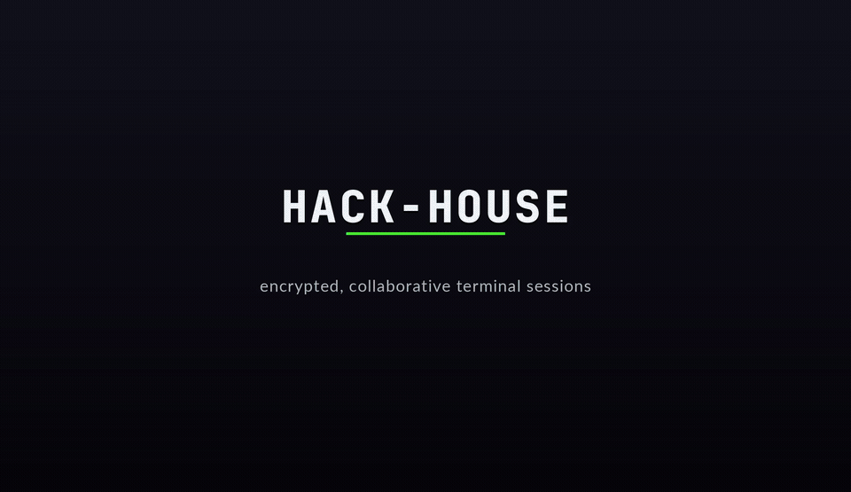

<div align="center">

# hack-house

### encrypted collaborative terminal sessions with a summoned sandbox

[](https://opensource.org/licenses/MIT)
[](https://www.rust-lang.org/)
[](https://www.python.org/downloads/)



*Two clients sharing a multipass sandbox — summon, drive the shell, real per-user sudo.*

</div>

---

Fork of [cmd-chat](https://github.com/diorwave/cmd-chat) — a privacy- and
security-oriented chatroom, extended with file sharing and shared terminal
sessions.

Encrypted chat that runs in your terminal. You host the server, you control the
room. Close the window — everything's gone. Messages and files are encrypted
client-side before the server ever sees them. Built for people who'd rather not
trust a corporation with their conversations: pairing, teaching, demos, hacking.


## Features

- **End-to-end encrypted** — Fernet (AES-128-CBC + HMAC), encrypted client-side before anything leaves your machine
- **SRP authentication** — the password is never sent over the network (zero-knowledge proof)
- **Zero-knowledge server** — relays only ciphertext; cannot read messages, files, or terminal output
- **RAM only** — nothing persisted on the server; close it and history is gone
- **Shared sandbox** — summon a disposable `local` / `docker` / `podman` / `multipass` box the whole room can watch and drive. Docker defaults to **Parrot OS Security** (`parrotsec/core`) and Podman to **Kali** (`kalilinux/kali-rolling`) — pentest distros out of the box; Podman is rootless & daemonless, so **no sudo** to launch
- **Snapshot save/load** — freeze a sandbox to a named snapshot and restore it later (`/sbx save` · `/sbx load` · `/sbx snaps`)
- **Local VirtualBox VMs** — `/sbx vms` detects VirtualBox and lists your VMs; `/sbx gui <vm>` opens a desktop VM locally for the room to gather around — per-user consent gate, with automatic resolution of VT-x conflicts (Docker Desktop / multipass)
- **Real permissions** — the host grants/revokes *drive* (keyboard) and *sudo* (VM superuser) per user; **stacking roster badges** show exactly who holds what, both in the clergy panel and inline on every chat message
- **Local-first AI agent** — `/ai start` summons an in-room AI that runs against *your own* [Ollama](https://ollama.com) (no API key, nothing leaves your machine); replies **stream token-by-token** with **in-RAM semantic recall** of the conversation for context; model-agnostic, addressed-only, end-to-end encrypted like every other client
- **AI that acts in the sandbox** — grant an agent *drive* and address it with `/ai <name> !<task>`; it works the shared box through a bounded, host-side **tool-calling loop** (run shell, write/read files, inspecting each result before the next step) and you watch its commands land live in the shared terminal. Ungranted, it stays **advisory-only** (tells you the commands, runs nothing); destructive commands are gated behind an explicit `/ai <name> confirm`
- **Encrypted file transfer** — `/send` → `/accept` with SHA-256 verification
- **Tor onion hosting (optional)** — expose a room via a per-session, throwaway Tor v3 onion address instead of any inbound port (`--tor`); the key is never written to disk and the address is gone the moment the server stops. Pair it with `web-relay` for a second onion + browser access (Orbot/Tor Browser) so a guest with no hack-house install — just a phone — can watch and chat too. See [Tor onion hosting](#tor-onion-hosting).
- **TLS** — self-signed by default, or bring your own cert; `--no-tls` for local/Tailscale use
- **Themes** — seven switchable "vestments" (`crypt` default · `church` · `neon` · `blush` · `matrix` · `wraith` · `goldcrypt`), plus a live randomizer

## Layout

| Path | What |
|------|------|
| `hh/` | The Rust `ratatui` client (the flagship) |
| `cmd_chat/`, `cmd_chat.py` | The Python (Sanic) server + legacy Python client |
| `cmd_chat/agent/` | The model-agnostic AI agent bridge (joins a room as an encrypted client) |
| `models.toml` | Named provider profiles for `/ai start <profile>` (see `docs/providers.md`) |
| `docs/providers.md` | Connect any model — profiles, flags, discovery, bring-your-own-provider |
| `hh/scripts/` | Helper scripts — setup, hosting, sandbox provisioning, tests (see [Scripts](#scripts); each takes `-h`/`--help`) |
| `hh/direnv-autostart/` | `cd` into a directory to auto-launch a session (direnv) |
| `cmd_chat/tor/` | Ephemeral Tor v3 onion service sidecar (`--tor` on `serve`) — see [Tor onion hosting](#tor-onion-hosting) |
| `scripts/tor-hardened-launch.sh` | Sandboxed Tor launcher (bwrap by default) for `--tor` hosting |
| `scripts/tor-onion-connect.sh` | Guest-side helper: finds a checkout + client regardless of cwd, wraps `torsocks` |
| `docs/spec-tor-p2p-relay.md` | Full design + OPSEC writeup for Tor onion hosting |

## Quick start

```bash
git clone https://git.churchofmalware.org/trilltechnician/hack-house.git
cd hack-house
```

### 1. One-shot setup (`hh/scripts/bootstrap.sh`)

Checks prerequisites, creates the Python venv, installs the server's
dependencies, and builds the Rust client:

```bash
hh/scripts/bootstrap.sh              # venv + deps + debug build
hh/scripts/bootstrap.sh --release    # release build
hh/scripts/bootstrap.sh --check      # report tooling only, change nothing
```

> `bootstrap.sh` does **not** touch direnv — the autostart in step 4 is a
> separate, opt-in convenience.

**Optional AI layer (`hh/scripts/bootstrap-ai.sh`).** Want the local `/ai` agent? This runs
the baseline setup first, then installs Ollama (if missing) and pulls a default
model — nothing here changes the AI-free baseline above:

```bash
hh/scripts/bootstrap-ai.sh                      # baseline + Ollama + qwen2.5:3b
hh/scripts/bootstrap-ai.sh --check              # report only, change nothing
HH_AI_MODEL=llama3 hh/scripts/bootstrap-ai.sh   # pull a different model
```

### 2. Try it in tmux (`scripts/lets-hack.sh`)

The fastest way to see it working: builds the client, boots a fresh `--no-tls`
server on `127.0.0.1:4173`, and opens a pane per user.

```bash
cd hh
./scripts/lets-hack.sh                  # alice + bob, tiled in tmux
./scripts/lets-hack.sh neo trinity      # custom users
./scripts/lets-hack.sh --theme neon     # pick vestments
./scripts/lets-hack.sh --reuse          # keep a live server (reconnect tests)
./scripts/lets-hack.sh --kill           # tear it all down
```

### 3. Manual setup

**Server** (Python):

```bash
pip install -r requirements.txt
python3 cmd_chat.py serve 0.0.0.0 3000 --password <room-password>
```

**Client** (Rust):

```bash
cd hh
cargo build --release
./target/release/hack-house connect <server_ip> 3000 <yourname> \
    --password <room-password> --insecure
```

| Flag | Purpose |
|------|---------|
| `--password` | Room password (required) |
| `--no-tls` | Connect without TLS (local / trusted tunnel) |
| `--insecure` | Skip TLS cert verification (self-signed certs) |
| `--theme <path>` | Load a vestments TOML (see `hh/themes/`) |

### 4. Autostart with direnv (optional, separate)

A convenience for daily use, independent of `bootstrap.sh`. Run the one-time
setup once:

```bash
cd hh/direnv-autostart
./setup.sh           # installs direnv, hooks bash/zsh, `direnv allow`s this dir
```

After that, simply `cd`-ing into the directory launches a single session for the
logged-in user with a freshly minted **in-memory** room password (reveal it
in-app with `/pw`, share it out-of-band to invite others). The password is
generated at launch and never written to disk — matching the project's RAM-only
model. If a session is already live, it just points you at it.

## Using it

Type to chat. Slash commands and keys:

| Command / key | Action |
|---|---|
| `<text>` ↵ | Send an encrypted chat message |
| `/help` · `F1` | Help overlay |
| `/pw` | Show this room's password (local only — never broadcast) |
| `/theme [name]` | Switch vestments, or list them |
| `/send <user> <path>` | Offer a file (or directory) directly to one member |
| `/sendroom <path>` | Offer a file (or directory) to the whole room |
| `/accept` · `/reject` | Respond to a pending file offer |
| `/clear` | Wipe your chat scrollback (local only) |
| `/ai start [model\|profile] [allow]` | Summon a local AI agent (default `ollama/qwen2.5:3b`; a bare name is a `models.toml` profile). `allow` auto-grants it sandbox drive at spawn |
| `/ai stop` | Dismiss the agent you summoned |
| `/ai <question>` | Ask the agent (`/ai <name> <question>` if several present) |
| `/ai <name> !<task>` | Have a *granted* agent act in the shared sandbox (advisory-only if it has no drive) |
| `/ai <name> confirm` | Approve a gated (destructive) command the agent proposed |
| `/ai list` | List the agents present (or hint to `/ai start` if none) |
| `/ai models` | Models the active agent can serve — or, with no agent, your local Ollama tags |
| `/sbx <local\|docker\|podman\|multipass> [image] [install]` | Summon the shared sandbox — the backend leads (`/sbx launch …` still works). Docker → **Parrot OS** (`parrotsec/core`), Podman → **Kali** (`kalilinux/kali-rolling`, rootless, no sudo). `install` fetches a missing backend; `docker --start` boots a stopped daemon |
| `/sbx stop` | Tear down the sandbox you host |
| `/sbx save [label]` · `/sbx load <label>` · `/sbx snaps` | Snapshot the sandbox, restore one, or list snapshots |
| `/sbx vms` | Detect VirtualBox and list local VMs |
| `/sbx vbox [new [name]]` | Open the local VirtualBox VM picker, or build a fresh VM via cloud-init |
| `/sbx gui <vm> [--install]` | Open a local VirtualBox desktop VM for the room (consent-gated) |
| `/drive` · `F2` | Take the shared shell (`Esc` releases) |
| `/grant <user>` · `/revoke <user>` | Owner: delegate/withdraw drive |
| `/sudo <user>` · `/unsudo <user>` | Owner: delegate/withdraw VM superuser |
| `Ctrl+C` · `Ctrl+Q` | Quit gracefully |
| `Ctrl+C` (while driving) | Interrupt the running command |
| `Ctrl+R` | Reconnect after a drop |
| `↑/↓` · `PgUp/PgDn` · mouse wheel | Scroll chat / sandbox scrollback |
| `F4` · `F5` · click | Layout: fullscreen terminal · select a pane to resize (then arrows · `Esc`) — see [Window layout](#window-layout) |
| `/layout save \| load \| list \| rm \| reset` | Save / recall named pane arrangements |

### The shared sandbox

Anyone in the room can summon a disposable Linux box with `/sbx <backend>`. The
person who summons it is the **owner/host**: their client runs the real PTY
locally and relays its output to everyone else as encrypted frames, so the
server only ever sees ciphertext (same trust model as chat).

| Backend | Isolation | Notes |
|---|---|---|
| `local` | none | a `bash` shell on the host — fast, for dev/testing only |
| `docker` | container | **Parrot OS Security** (`parrotsec/core`) by default — swap `parrotsec/security` per-launch for the full pentest set; `/sbx docker --start` boots the daemon (or run `hh/scripts/ensure-docker.sh`) |
| `podman` | container | **Kali rolling** (`kalilinux/kali-rolling`) by default — **rootless & daemonless, no sudo to launch** (add `kali-linux-headless` for the toolset); `hh/scripts/ensure-podman.sh` installs it |
| `multipass` | full VM | `24.04` by default; strongest isolation, ~30 s to boot, the choice for real use |

The backend leads the command — `/sbx podman`, `/sbx docker`, `/sbx multipass`,
`/sbx local` (the older `/sbx launch <backend>` still works). Override the image
positionally, e.g. `/sbx docker parrotsec/security` or `/sbx podman ubuntu:24.04`.
Both container engines are Debian/apt-based, so the dev-toolchain bootstrap runs
unchanged. Tear it down with `/sbx stop` (purges the VM/container).

**Snapshots.** Freeze the current sandbox to a named checkpoint with `/sbx save
[label]`, list what you've stored with `/sbx snaps`, and restore one later with
`/sbx load <label>` — handy for resuming a half-built environment or replaying a
demo from a known-good state.

**Local VirtualBox VMs.** Separate from the relayed sandbox, `/sbx vms` detects a
VirtualBox install and lists your VMs, and `/sbx gui <vm>` boots one as a full
desktop VM **on your own machine** (`--install` offers to install VirtualBox
first if it's missing). It's not owner-gated — the per-user confirmation gate
*is* the permission, so everyone opens their own copy. If a hardware hypervisor
(Docker Desktop, multipass) is holding VT-x, hack-house detects the conflict and
offers to stop it so the VM can boot.

### Driving the shell

The shared terminal is **watch-by-default**: everyone sees the live output, but
only granted drivers can type into it.

- `/drive` (or `F2`) takes the keyboard; `Esc` releases it. `/drive` exists so
  the whole flow works on mobile/SSH clients with no function keys.
- While driving, your keystrokes go to the PTY; `Ctrl+C` interrupts the running
  command (it does **not** quit the app).
- `PgUp`/`PgDn` and the mouse wheel scroll the terminal's scrollback even while
  driving; `End` jumps back to live.

### Unix permission control

Permissions are enforced at **two layers**:

1. **App-level drive ACL** — who is allowed to type into the shared shell.
   The owner runs `/grant <user>` / `/revoke <user>`.
2. **Real VM identities** — on `multipass`/`docker`, each member is provisioned
   an actual unix account, with the owner as superuser. On `multipass`,
   `/sudo <user>` / `/unsudo <user>` toggle real `sudo` rights inside the VM, so
   "may type" and "may run privileged commands" are independent and enforced by
   the OS itself.

The roster shows each member's status with **stacking badges**: host (the
theme's sigil, e.g. `✝`), sudoer (⚡), driver (◆), and member (•). They're
additive — a host who summoned a sandbox and can drive reads `✝⚡◆` — and the
host badge appears the moment someone is first in the room, before any sandbox
exists. The same badge is rendered inline next to the author on every chat
message, so a message's authority is legible right in the transcript, not only
in the side panel. Because the badges read the exact ACL the sandbox enforces,
they can never advertise a power the room won't honour.

### Sharing files & directories

`/send <user> <path>` proposes a transfer to one member; `/sendroom <path>`
offers it to everyone. Recipients `/accept` or `/reject`. A whole directory
works too (it's packed into a `.tar` before sending). Files are chunked (64 KB),
encrypted with the room key, relayed as opaque ciphertext, and **SHA-256
verified** on arrival before landing in `./downloads/`. Max size is 50 MB.

### The AI agent (local-first)

Summon an AI participant with `/ai start` — it joins the room as a normal
encrypted client (same SRP + room key as everyone else) and answers when you
address it with `/ai <question>`. `/ai stop` dismisses it (it's also cleaned up
when you quit). Pick a model at summon time with `/ai start <model>`.

- **Runs on *your* machine.** The default provider is [Ollama](https://ollama.com)
  — a local model (default `qwen2.5:3b`), no API key, nothing leaves your host.
  Run `hh/scripts/bootstrap-ai.sh` once to install it and pull the model.
- **Addressed-only.** The agent reads room traffic like any client but forwards
  to the model *only* the messages that trigger it (`/ai …`) — no passive
  surveillance, no cost or noise when idle.
- **Can drive the sandbox.** Grant an agent *drive* (`/grant <name>`, or summon it
  pre-granted with `/ai start <name> allow`) and ask it to act with
  `/ai <name> !<task>`. It works the shared box through a bounded **host-side
  tool-calling loop** — run shell commands, write and read files — inspecting each
  result before the next step, and you watch its commands appear live in the
  shared terminal. Every command runs *inside the sandbox* (the container/VM is the
  blast radius), capped in count and time. Without drive it stays **advisory-only**
  (it spells out the commands, runs nothing). Destructive commands are blocked
  pending an explicit `/ai <name> confirm`.
- **Model-agnostic.** Swap the backend without touching the client: bundled
  adapters for `ollama` (default), `anthropic`, and any OpenAI-compatible
  endpoint (OpenAI, Groq, Together, local vLLM…), plus a `module:Class` hook for
  your own. Cloud providers are opt-in and read their API key from the agent's
  environment — never the room.
- **Named profiles.** Register a backend once in `models.toml` and summon it by
  name: `/ai start groq-llama`. Profiles store `api_key_env` (the *name* of an
  env var, never the key), so the file is safe to commit. See the full
  [provider guide](docs/providers.md) — profiles, explicit flags, discovery, and
  bring-your-own-provider.
- **Discoverable.** `/ai list` shows who's present and `/ai models` shows what
  the active agent can serve (active model bracketed). With no agent running,
  `/ai models` still probes your local Ollama so you can see what's pullable
  before summoning. By hand, `--list-models` enumerates a backend and `--check`
  preflights it (exit 0/1) without joining a room.
- **End-to-end like everything else.** Replies are encrypted client-side; the
  server still only ever relays ciphertext.

Each agent uses one room seat — raise `CMD_CHAT_MAX_USERS` if the room is full.
To run an agent by hand (a cloud provider, or on another host), drive the bridge
directly:

```bash
.venv/bin/python -m cmd_chat.agent <server_ip> <port> \
    --password <room-pw> --provider ollama --model qwen2.5:3b
# joins as its model tag ("qwen2.5:3b") unless you override with --name
# cloud (opt-in): --provider anthropic --model claude-opus-4-6   (needs ANTHROPIC_API_KEY)
```

### Themes (vestments)

Seven bundled themes — `crypt` (default, neutral monochrome, `✝` sigil),
`church`, `neon`, `blush`, `matrix`, `wraith`, and `goldcrypt`. Switch live with
`/theme <name>`, list them with bare `/theme`, roll a fresh randomized vestment
with `Ctrl+Alt+P` (keep one you like with `/theme save [name]`), or load your own
TOML at launch with `--theme <path>` (see `hh/themes/`). Each theme defines its
own sigil, colours, and roster width.

### Window layout

The chat, roster (clergy), sandbox-terminal, and message-input panes are
resizable and can be fullscreened — live, with no restart. Resizing the terminal
also re-syncs the shared PTY grid so everyone in the room sees the same
dimensions.

- **Fullscreen** — `F4` cycles the sandbox terminal fullscreen → chat
  fullscreen → back to the split. The input bar always stays visible, so
  `F4` always brings you back.
- **Resize a pane** — click a pane (or press `F5` to cycle the selection:
  chat → terminal → roster → input). The selected pane gets a bold accent border
  and an `✎` marker in its title. The chat/terminal/roster panes form a binary
  split tree, so **every pane resizes on both axes** wherever a divider bounds it:
  - `↑` / `↓` grow / shrink the selected pane's **height**. With a sandbox up,
    chat trades against the terminal directly below it. With no sandbox, chat and
    the clergy instead **borrow from the message bar** — `↑` grows the chat box
    (shrinks the input), `↓` does the reverse — so vertical resize always moves
    something. The **input bar** itself is also selectable and grows on `↑/↓`.
  - `←` / `→` grow / shrink the selected pane's **width** (the chat/terminal
    column trades with the roster, down to hidden). Resizing the terminal's
    width now re-syncs the shared PTY too, not just its height.
  - `Esc` or `Enter` finishes editing.
- **Presets** — save the current arrangement and recall it later:

  | Command | Effect |
  |---|---|
  | `/layout` | Show the current arrangement + a reminder of the keys |
  | `/layout save <name>` | Save the current split/roster to `hh/layouts/<name>.toml` |
  | `/layout load <name>` (or `/layout <name>`) | Re-apply a saved layout |
  | `/layout list` | List saved presets |
  | `/layout rm <name>` | Delete a saved preset |
  | `/layout reset` | Restore the default split |

### Staying connected

If the connection drops (network blip, laptop sleep), press `Ctrl+R` to re-run
the SRP handshake and re-attach — no restart needed. If you were hosting the
sandbox, it's re-announced so the room re-syncs the shared shell. Chat keeps up
to ~4000 lines of scrollback; the sandbox terminal keeps 2000.

## Scripts

Everything lives in `hh/scripts/`; run from the `hh/` directory. **Every script
supports `-h` / `--help`** for full usage.

**Setup**

| Script | What it does |
|---|---|
| `bootstrap.sh` | One-shot first-run setup: checks prereqs, creates the Python venv, installs server deps, builds the Rust client (plus the AI layer unless `--no-ai`). |
| `bootstrap-ai.sh` | Optional AI layer: runs the baseline, then installs Ollama and pulls a default local model for the `/ai` agent. |

**Run a session**

| Script | What it does |
|---|---|
| `lets-hack.sh` | Local demo/test: boots a `--no-tls` server and tiles one TUI client pane per user in tmux. |
| `host-house.sh` | Host a real room *and* take a seat — builds the client, starts the server, and opens your own client, all in tmux. |
| `host-room.sh` | Host the server only (no seat): mints a password, frees the port, prints the LAN/Tailscale join banner, runs in the foreground. |
| `connect.sh` | Join a room with the password kept RAM-only (no-echo prompt). Flags: `--sync` (pull latest code before building), `--tls`, `--insecure`, `--no-build`, `-P PORT`. |

**Sandbox provisioning** — driven by the client at runtime; you rarely run these by hand

| Script | What it does |
|---|---|
| `ensure-docker.sh` | Install Docker and/or start its daemon (idempotent; `--check`/`--plan`/`--yes`). Invoked by `/sbx docker`. |
| `ensure-podman.sh` | Install Podman (rootless; sets up subuid/subgid). Daemonless — nothing to start. Invoked by `/sbx podman`. |
| `ensure-multipass.sh` | Install Multipass. Invoked by `/sbx multipass`. |
| `ensure-vbox.sh` | Install VirtualBox (warns on Secure Boot). Invoked by `/sbx vbox` and `/sbx gui`. |
| `vbox-new.sh` | Create + boot a fresh Ubuntu VirtualBox VM via cloud-init. Invoked by `/sbx vbox new`. |
| `sandbox-bootstrap.sh` | Baseline dev-tool install piped into a Docker sandbox at provision time (package list from `sandbox-tools.json`). |
| `sandbox-tools.json` | Editable package list consumed by `sandbox-bootstrap.sh`. |

**Tests & demos** — for contributors

| Script | What it does |
|---|---|
| `smoke-e2e.sh` | Headless CI smoke test: server + two real TUI clients in tmux; asserts SRP join, chat round-trip, `/sbx` dispatch. |
| `smoke.sh` | Crypto smoke test: Rust unit tests → SRP self-test → live server → Rust handshake → Python decrypts the Rust-sent message. |
| `test-features.sh` | Broad TUI regression: drives owner + member panes and scrapes the screen to assert ~13 UI features. |
| `demo-save-load.sh` | PoC harness proving the persistent-sandbox flow (`/sbx save` → quit → `/sbx load`, code intact). |

`hh/scripts/archive/` holds personal demo-*recording* scripts (`film-*.sh`) that
depend on external video tooling — not needed to use or develop hack-house.

## Configuration

| Variable | Where | Effect |
|---|---|---|
| `CMD_CHAT_MAX_USERS` | server | Room capacity (default `4`) |
| `PORT` · `PW` · `HOST` | `scripts/lets-hack.sh` | Override the test server's port / password / bind host |
| `THEME` | `scripts/lets-hack.sh` | Vestments for every pane (`church` · `neon` · `crypt`) |
| `HH_SESSION` · `HH_USER` | direnv autostart | tmux session name / your in-session name |

## Securing your connection

- **Tailscale (recommended)** — both parties join a tailnet; traffic rides an encrypted WireGuard tunnel, no port forwarding. Connect with `--no-tls` over the trusted tunnel, or keep TLS on.
- **LAN** — use your local IP; both devices on the same network.
- **Public internet** — forward the port and use a real cert (`--cert`/`--key` on the server).
- **Tor (no network access needed at all)** — see below.

Share the room password out-of-band (in person, a disappearing Signal message,
or a one-time-secret link) — never over an unencrypted channel.

## Tor onion hosting

No inbound port, no Tailscale, no domain — the room gets a fresh, throwaway
`.onion` address that only exists for that one session. Good for a quick
one-off with someone you don't want to hand a real network path to, or hosting
from behind CGNAT/a coffee-shop network with zero setup on the router.

**Requirements:** `tor` installed on the host (`sudo dnf install tor` /
`apt install tor`); `stem` on the host (already in `requirements.txt`);
`torsocks` on the **guest's** machine only (the host doesn't need it).

### Host

```bash
# plain — talks to whatever tor ControlPort is already running (system tor,
# or a hardened instance you started yourself — see below)
python cmd_chat.py serve 127.0.0.1 9000 --password <pw> --no-tls --tor
```
```
[tor] ephemeral onion service: xxxxxxxxxxxxxxxxxxxxxxxxxxxxxxxxxxxxxxxxxxxxxxxxxxxxxxxx.onion:9000
```

That address is what you hand to a guest. It's minted fresh every run
(`ADD_ONION`, key never written to disk) and destroyed the moment the server
stops — nothing to clean up, nothing reusable across sessions.

`serve --tor` **refuses to start on a non-loopback bind address by default**
(pass `--tor-allow-public-bind` if you deliberately also want a plain public/LAN
listener at the same time — most people don't).

**Recommended: sandbox the Tor process itself.** `scripts/tor-hardened-launch.sh`
runs `tor` inside `bwrap` (no extra dependency — already on most Linux desktops)
with a Unix-socket Control/Socks port, cookie-only auth, and full (not
single-hop) onion mode, so a Tor daemon bug can't see your `$HOME` or other
processes:

```bash
scripts/tor-hardened-launch.sh
# prints: CONTROL_SOCKET=/run/user/1000/hh-tor-XXXXXX/control.sock
python cmd_chat.py serve 127.0.0.1 9000 --password <pw> --no-tls \
  --tor --tor-control-socket /run/user/1000/hh-tor-XXXXXX/control.sock
```

### Guest

Same client either way (Rust `hh` or `cmd_chat.py connect`) — Tor is just the
transport, wrapped with `torsocks` so the connection routes through your local
Tor SOCKS proxy instead of dialing out directly.

**Easiest: `scripts/tor-onion-connect.sh`.** The raw commands below assume
you're sitting in a hack-house checkout root, which breaks the moment your
shell lands somewhere else. This helper finds a checkout regardless of your
current directory (checks `$PWD`, the script's own repo, then the usual
`~/coding/hack-house/*` spots — override with `--repo`/`HH_REPO`), prefers the
built Rust TUI, falls back to the Python client if that's not built, and
wraps either in `torsocks` for you:

```bash
scripts/tor-onion-connect.sh <onion-address> 9000 <name> --password <pw>
# works from anywhere — no need to cd into the checkout first
```

Raw form, if you'd rather not use the helper (must be run from a checkout root):

```bash
torsocks hh/target/debug/hack-house connect <onion-address> 9000 <name> --password <pw> --no-tls
# or:
torsocks python cmd_chat.py connect <onion-address> 9000 <name> --password <pw> --no-tls
```

Your own system `tor` needs to already be running (most Linux distros ship it
as a `systemctl start tor` away; `torsocks` talks to it on `127.0.0.1:9050` by
default — nothing else to configure).

**Current limitation:** the guest needs the external `torsocks` wrapper for
now — in-process SOCKS support (so `--tor` becomes a plain client flag, no
wrapper needed) is planned but not yet landed. Full design, the OPSEC posture
(why full onion mode not single-hop, why guard rotation is deliberately *not*
done, DataDirectory hygiene, the bind-address footgun this guards against) and
the roadmap live in [`docs/spec-tor-p2p-relay.md`](docs/spec-tor-p2p-relay.md).

### Browser access for mobile (optional)

Everything above is terminal-only — the guest needs hack-house installed. For
someone who doesn't (a phone with nothing but a browser), pair Tor hosting
with **`web-relay`** (a separate, unmerged branch — `git worktree add` it
alongside `main` if you don't have it checked out) instead of Tailscale/a
domain: mint a *second* onion service fronting the relay's port, and hand out
that link instead.

```bash
# 1. the room itself, same as any --tor host
python cmd_chat.py serve 127.0.0.1 9000 --password <pw> --no-tls --tor

# 2. from the web-relay worktree: the relay (loopback only — its own
#    safety gate refuses a public bind) + a publisher that joins the room
cd ../web-relay   # or wherever that worktree lives
.venv/bin/python -m web-relay.relay --host 127.0.0.1 --port 8080 --no-tls &
.venv/bin/python -m cmd_chat.web 127.0.0.1 9000 --password <pw> --no-tls \
  --relay http://127.0.0.1:8080 --public-url http://<relay-onion-address> \
  --label "hack-house room"

# 3. mint the relay's own onion, fronting :8080 — same tor daemon/ControlPort
#    as step 1, `detached=True` so it survives this being a one-shot script
python - <<'PY'
from cmd_chat.tor.onion import EphemeralOnion
onion = EphemeralOnion()   # or control_socket=... for the hardened launcher
service = onion.start(target_port=8080, virtual_port=80, detached=True)
print(service.address)   # ← this is <relay-onion-address> for step 2's --public-url
PY
```

Hand the guest `http://<relay-onion-address>/r/<slug>#k=<key>` (printed by the
publisher). **They need Orbot or Tor Browser** — a stock Chrome/Safari cannot
open `.onion` links at all, no matter what's scanned; there's no way around
that, it's inherent to how onion services resolve. This is why it's presented
as an *optional add-on* to terminal hosting, not a replacement for it: the two
onions are independent (killing the room's tor daemon takes both down at
once, since they share it), and nothing about the terminal path above changes.

Both onions live on the **same** tor daemon/ControlPort — no second `tor`
process needed. `hh-go onion browser` (a personal deployment script, not part
of this repo) automates exactly this sequence if you're on a box that already
has it, including a QR code for the share link and a guard against silently
reusing a stale process on the relay's port.

## How it works

```
CLIENT                              SERVER                         CLIENT
  │── POST /srp/init {A} ──────────►│                               │
  │◄── {B, salt, room_salt} ────────│                               │
  │  derive room_key = HKDF(password, room_salt)                    │
  │── POST /srp/verify {M} ────────►│                               │
  │◄── {H_AMK, ws_token} ───────────│                               │
  │══ WSS /ws/chat?ws_token ═══════►│◄══════════════════════════════│
  │  encrypt(msg, room_key) ───────►│──── ciphertext ──────────────►│
  │                                  │        decrypt(ct, room_key)  │
  │  server stores ONLY ciphertext — it cannot read messages        │
```

- **SRP** — both sides prove they know the password without transmitting it.
- **Room key** — each client derives `HKDF(password, room_salt)` independently; the server never holds it.
- **Sandbox** — the host runs a PTY locally and relays its output as encrypted `_sbx` frames; drivers' keystrokes flow back the same way. Permissions are enforced both at the app layer (drive ACL) and in the VM (real unix users / sudo).

### Crypto parity

```bash
cd hh
cargo run -- selftest                              # offline: Rust SRP ≡ Python golden vectors
cargo run -- handshake <ip> <port> <name> --password <pw> --no-tls
```

## Contributing

See [CONTRIBUTING.md](CONTRIBUTING.md). Security reports: see [SECURITY.md](SECURITY.md).

## License

MIT · *hack the planet*
